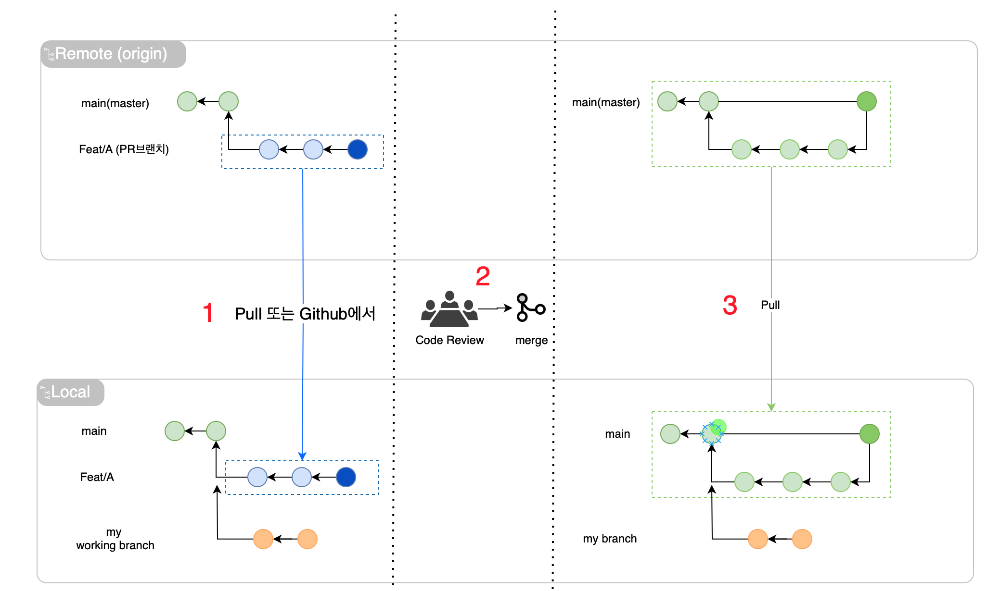
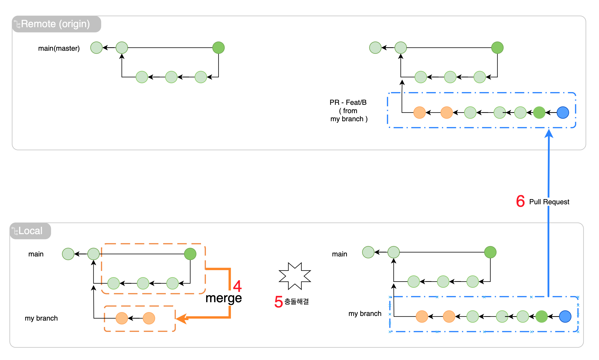

# Mataju 클라이언트 다운로드 랜딩 페이지
마타유 프로젝트의 데스크탑 클라이언드 설치 다운로드 페이지 (Static Web Page)

각 플랫폼별 데스크탑 클라이언트(다른 레포지토리에서 개발)의 설치파일이 배포되고나면 본 랜딩페이지의 다운로드 버튼 링크를 업데이트하세요.

# Git 브랜치전략을 통한 배포
`Github flow`를 통해 `main(master)` 브랜치에 병합될 때 자동배포

## Pull Request와 코드리뷰 안내
Github에 다른 사람이 올린 PR이 올라오면 github에서 또는 로컬 레포지토리로 해당 PR브랜치를 Pull하고 코드를 리뷰해주세요. 깃헙에서 해당 브랜치가 main에 머지되고 나면 main 브랜치를 다시 로컬로 pull하여 로컬 main을 깃허브와 일치시켜주세요.
 

 이전에 작업해오던 로컬 작업 브랜치에 main을 merge해보아 충돌을 해결한 뒤 작업을 이어서 할 수 있습니다. 로컬 작업 브랜치의 코드가 완료되면 해당 브랜치를 깃허브로 push한뒤 Pull Request를  생성해주세요.
 